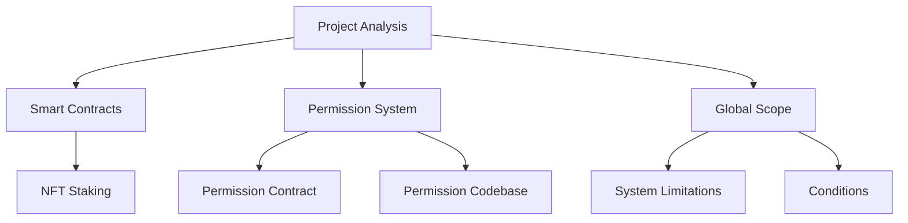
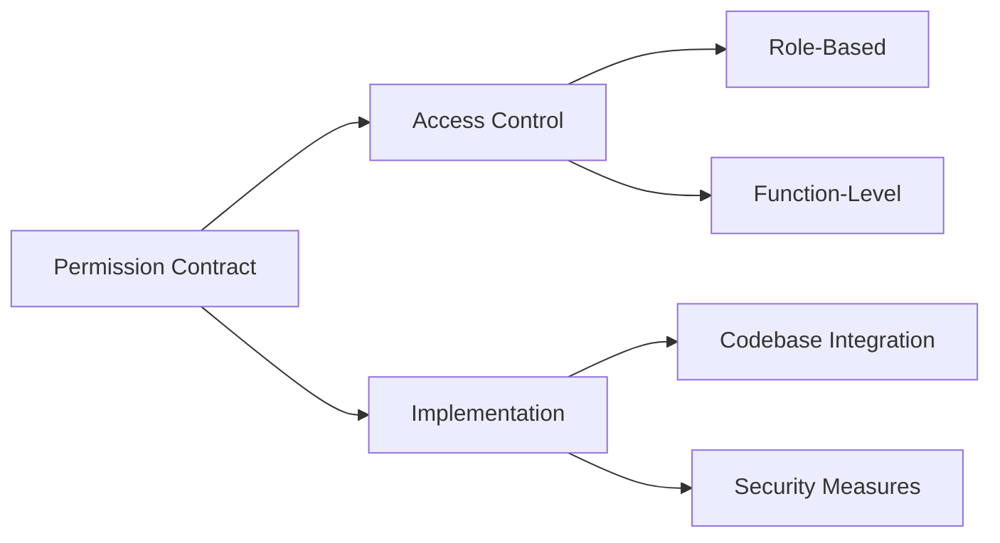
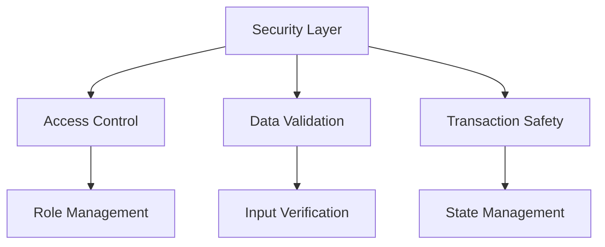

# Project Analysis Documentation

## Overview
This repository contains an extensive analysis of a blockchain-based NFT staking system realized by Jose Tomas Perez-Acle, focusing on security, permissions, and architectural design. The analysis covers smart contract evaluation, permission structures, and implementation considerations.

## Project Structure

## Key Components

### 1. Smart Contract Analysis
- Detailed review of NFT Staking implementation
- Security considerations and potential vulnerabilities
- Optimization recommendations

### 2. Permission System

### 3. Security Considerations

### 4. Scope Analysis
- Global system boundaries
- Operational limitations
- Conditional requirements

## Documentation Structure
- `global_scope.md`: System-wide considerations and boundaries
- `limits_or_conditions.md`: Operational constraints and requirements
- `permissions_contract.md`: Detailed permission system analysis
- `permissions_codebase.md`: Implementation details and recommendations

## Getting Started
To navigate this analysis:
1. Start with this README for a high-level overview
2. Review the global scope documentation
3. Examine specific components through dedicated markdown files

## License
All rights reserved.

---
*This analysis is part of a comprehensive review of blockchain-based NFT staking systems and their security implementations.*
