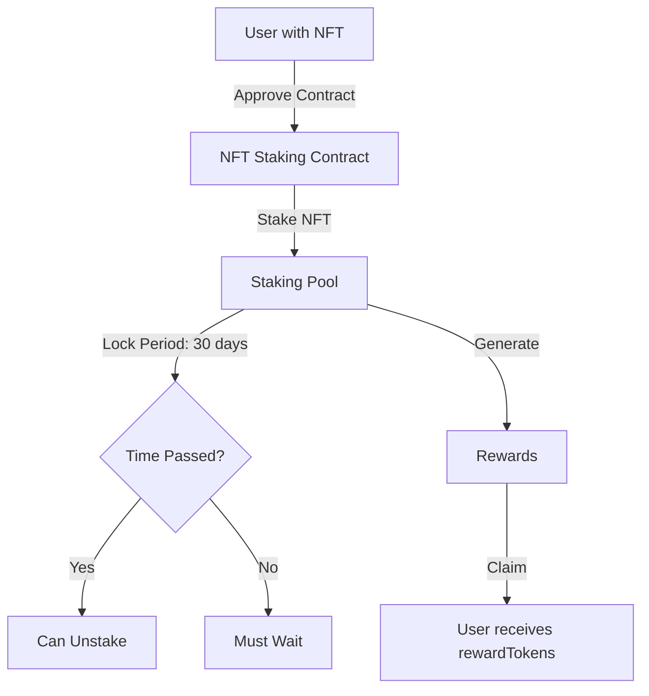

# NFT Staking System Documentation

This document provides a comprehensive analysis of the NFT staking system, including both the smart contract `NFTStaking.sol` and its integration with the frontend. 

---

## Table of Contents

1. [Introduction](#introduction)
2. [Smart Contract Analysis](#smart-contract-analysis)
   - [Contract Overview](#contract-overview)
   - [State Variables](#state-variables)
     - [Administrative Variables](#administrative-variables)
     - [Token Interfaces](#token-interfaces)
     - [Counters](#counters)
   - [Structs and Mappings](#structs-and-mappings)
     - [Struct: `NFTStakeBlock`](#struct-nftstakeblock)
     - [Storage Mappings](#storage-mappings)
   - [Modifiers](#modifiers)
   - [Constructor](#constructor)
   - [Functions](#functions)
     - [Administrative Functions](#administrative-functions)
     - [Staking Functions](#staking-functions)
     - [Reward Functions](#reward-functions)
     - [Utility Functions](#utility-functions)
   - [Error Handling](#error-handling)
   - [Events](#events)
3. [Frontend Integration](#frontend-integration)
   - [Initialization](#initialization)
   - [Token Approval Flow](#token-approval-flow)
   - [Staking Process](#staking-process)
   - [Unstaking Process](#unstaking-process)
   - [Claiming Rewards](#claiming-rewards)
4. [Security Measures](#security-measures)
   - [Access Control](#access-control)
   - [Reentrancy Protection](#reentrancy-protection)
   - [State Consistency](#state-consistency)
5. [Time-Based Restrictions](#time-based-restrictions)
   - [Staking Period](#staking-period)
   - [Lock Period](#lock-period)
6. [Integration Points](#integration-points)
   - [Frontend Requirements](#frontend-requirements)
   - [Smart Contract Interactions](#smart-contract-interactions)
7. [Known Issues and Recommendations](#known-issues-and-recommendations)
   - [End Date Enforcement](#end-date-enforcement)
   - [ERC-721 Compliance](#erc-721-compliance)
   - [Reward Calculation Accuracy](#reward-calculation-accuracy)
   - [Array Handling in Unstaking](#array-handling-in-unstaking)
   - [Missing Events](#missing-events)
8. [Conclusion](#conclusion)

---

## Introduction

The NFT Staking System allows users to stake their NFTs from a specific collection to earn rewards in the form of `rewardToken` ERC-20 tokens. Users can stake NFTs, accumulate rewards over time, and unstake their NFTs after a lock-up period.



---

## Smart Contract Analysis

### Contract Overview

The `NFTStaking` contract facilitates:

- **Staking NFTs**: Users can stake their NFTs from the specified collection.
- **Earning Rewards**: Accumulating `rewardToken` tokens over the staking period.
- **Unstaking NFTs**: Retrieving their NFTs after a lock-up period.
- **Claiming Rewards**: Claiming the accumulated `rewardToken`.

The contract manages:

- **Staking Periods**: Controls when staking can start and end.
- **Stake Tracking**: Records information about staked NFTs and their owners.
- **Reward Calculations**: Determines how many tokens a user has earned.
- **Administrative Functions**: Allows the admin to control certain aspects of the contract.

### State Variables

#### Administrative Variables

- `address private _admin;`
  - The address of the contract administrator with special privileges.
- `uint256 private _startDate;`
  - The timestamp when staking begins.
- `uint256 private _endDate;`
  - The timestamp when staking ends (90 days after `_startDate`).

#### Token Interfaces

- `IERC721 public immutable nftCollection;`
  - Interface for interacting with the NFT collection.
- `IERC20 public immutable rewardToken;`
  - Interface for interacting with the reward ERC-20 token.

#### Counters

- `uint256 public nftTotalStaked;`
  - The total number of NFTs currently staked in the contract.

### Structs and Mappings

#### Struct: `NFTStakeBlock`

```solidity
struct NFTStakeBlock {
    address owner;       // Address of the NFT staker
    uint256 tokenId;     // ID of the staked NFT
    uint256 stakeTime;   // Timestamp when NFT was staked
    uint256 lockPeriod;  // Duration NFT must remain staked (30 days)
}
```

#### Storage Mappings

```solidity
mapping(uint256 => NFTStakeBlock) private _stakePool;     // Tracks staked NFTs
mapping(address => uint256[]) private _ownedPoolTokens;   // Lists NFTs staked by address
mapping(address => uint256) private _claimedRewards; // Tracks claimed rewards
```

### Modifiers

- `modifier onlyAdmin()`
  - Restricts function access to the admin address.

    ```solidity
    modifier onlyAdmin() {
        require(msg.sender == _admin, "onlyAdmin: You are not Admin.");
        _;
    }
    ```

- `modifier canStake()`
  - Ensures staking is currently allowed (staking period is active).

    ```solidity
    modifier canStake() {
        require(getCanStake(), "You cannot stake at this time");
        _;
    }
    ```

### Constructor

```solidity
constructor(address _nftCollection, address _rewardToken) {
    _admin = msg.sender;
    nftCollection = IERC721(_nftCollection);
    rewardToken = IERC20(_rewardToken);
}
```

- Sets the deployer as the admin.
- Initializes interfaces for the NFT collection and reward token.

### Functions

#### Administrative Functions

1. **`startStake()`**

   ```solidity
   function startStake() external nonReentrant onlyAdmin()
   ```

   - Initializes the staking period by setting `_startDate` and `_endDate`.
   - Ensures staking cannot be started more than once.
   - **Important Note**: The current implementation does not allow restarting staking once stopped.

2. **`transferAdmin(address newAdmin)`**

   ```solidity
   function transferAdmin(address newAdmin) external nonReentrant onlyAdmin()
   ```

   - Transfers administrative privileges to `newAdmin`.

#### Staking Functions

1. **`stake(uint256 tokenId)`**

   ```solidity
   function stake(uint256 tokenId) external nonReentrant canStake()
   ```

   - Allows a user to stake an NFT they own.
   - **Process**:
     - **Ownership Verification**: Ensures the caller owns the NFT.
     - **Duplicate Stake Check**: Confirms the NFT is not already staked.
     - **NFT Transfer**: Transfers the NFT to the contract.
     - **Record Keeping**: Updates `_stakePool` and `_ownedPoolTokens`.
     - **Counter Update**: Increments `nftTotalStaked`.

2. **`unstake(uint256 tokenId)`**

   ```solidity
   function unstake(uint256 tokenId) external nonReentrant
   ```

   - Allows a user to unstake their NFT after the lock-up period.
   - **Process**:
     - **Ownership Verification**: Checks if the caller is the staker.
     - **Lock-Up Period Check**: Ensures the lock-up period has passed.
     - **NFT Transfer**: Transfers the NFT back to the owner.
     - **Record Deletion**: Removes staking data from mappings.
     - **Counter Update**: Decrements `nftTotalStaked`.

#### Reward Functions

1. **`claimReward(address ownerAddress)`**

   ```solidity
   function claimReward(address ownerAddress) external nonReentrant
   ```

   - Allows a user to claim their earned rewards.
   - **Process**:
     - **Reward Calculation**: Uses `getOwnedRewards` to calculate claimable rewards.
     - **Token Transfer**: Transfers the calculated tokens to the user.
     - **Record Update**: Updates `_claimedRewards`.

#### Utility Functions

1. **`getCanStake()`**

   ```solidity
   function getCanStake() public view returns (bool)
   ```

   - Returns `true` if staking is currently allowed.
   - **Current Implementation**: Only checks if staking has started.
   - **Recommendation**: Include end date check.

2. **`getOwnedTokens(address ownerAddress)`**

   ```solidity
   function getOwnedTokens(address ownerAddress) public view returns (uint256[] memory)
   ```

   - Returns a list of `tokenId`s that the user has staked.

3. **`getOwnedRewards(address ownerAddress)`**

   ```solidity
   function getOwnedRewards(address ownerAddress) public view returns (uint256)
   ```

   - Calculates the total rewards earned by the user across all staked NFTs.
   - **Calculation Logic**:
     - For each staked NFT:
       - If fully staked (lock period passed): `lockPeriod / 60 / 10`
       - If still staking: `(currentTime - stakeTime) / 60 / 10`
     - **Note**: This calculation assumes that users earn 0.1 rewards per minute.

4. **`getTokenRewards(uint256 tokenId)`**

   ```solidity
   function getTokenRewards(uint256 tokenId) public view returns (uint256)
   ```

   - Calculates the rewards earned by a specific staked NFT.

5. **`getDaysToUnstake(uint256 tokenId)`**

   ```solidity
   function getDaysToUnstake(uint256 tokenId) public view returns (uint256)
   ```

   - Returns the remaining time until an NFT can be unstaked.
   - If the lock-up period is over, returns `0`.

### Error Handling

- Uses custom errors to save gas and provide clarity:

  ```solidity
  error Staking__TransferFailed();
  error Unstake__TransferFailed();
  error ClaimReward__TransferFailed();
  ```

- Employs `require` statements with descriptive messages to enforce conditions throughout the contract.

### Events

- **Current Status**: The contract does not emit any events.
- **Recommendation**: Implement events for key actions:

  ```solidity
  event NFTStaked(address indexed staker, uint256 tokenId, uint256 stakeTime);
  event NFTUnstaked(address indexed staker, uint256 tokenId, uint256 unstakeTime);
  event RewardsClaimed(address indexed claimer, uint256 amount, uint256 claimTime);
  ```

---

## Frontend Integration

### Initialization

- **Web3 Connection**: The frontend must connect to the user's Web3 wallet (e.g., MetaMask).
- **Contract Instances**: Initialize instances of the staking contract and NFT collection using the user's address and the contract addresses.

### Token Approval Flow

- Before staking, the user must approve the staking contract to transfer their NFT.

```javascript
export const nftStake = async (address, tokenId) => {
    // Initialize contracts
    await initNftStakingContract(address);
    await initNftCollectionContract(address);

    // Request NFT approval
    let approvalTx = await nftCollectionContract.approve(
        stakingContractAddress,
        tokenId
    );

    // Wait for approval confirmation
    let approvalResult = await approvalTx.wait();

    // Proceed with staking if approved
    if (approvalResult.transactionHash) {
        let stakeTx = await nftStakingContract.stake(tokenId);
        // Handle staking result
    }
};
```

- **Notes**:
  - Ensure the user is informed about the approval request.
  - Provide clear instructions and status updates.

### Staking Process

- After approval, the frontend calls the `stake` function.
- The frontend should:
  - Handle transaction confirmation and errors.
  - Update the user interface to reflect the staked NFT.

### Unstaking Process

- Users can unstake their NFTs after the lock-up period.
- The frontend should:
  - Check the lock-up period using `getDaysToUnstake`.
  - Enable the unstake button when the NFT is eligible.
  - Handle the unstake transaction and update the UI accordingly.

### Claiming Rewards

- Users can claim their rewards at any time.
- The frontend should:
  - Display the total claimable rewards using `getOwnedRewards`.
  - Subtract `_claimedRewards` to calculate unclaimed rewards.
  - Handle the claim transaction and update the user's token balance.

---

## Security Measures

### Access Control

- **Admin Functions**:
  - Only the admin can call functions marked with `onlyAdmin`.
  - Critical functions like `startStake` and `transferAdmin` are protected.

- **User Functions**:
  - Ownership checks before staking and unstaking to prevent unauthorized actions.

### Reentrancy Protection

- **NonReentrant Modifier**:
  - Applied to external functions to prevent reentrancy attacks.
  - Utilizes OpenZeppelin's `ReentrancyGuard`.

### State Consistency

- **Stake Records**:
  - Accurate tracking of staked NFTs and their details.

- **Potential Issues**:
  - Using `delete` on array elements in `_ownedPoolTokens` may leave gaps, affecting array length and loops.

- **Recommendation**:
  - Implement proper array element removal to maintain consistency.

---

## Time-Based Restrictions

### Staking Period

- **Start**: Begins when the admin calls `startStake()`.
- **Duration**: Runs for 90 days.
- **Control**: Managed by the `canStake` modifier and `getCanStake` function.

### Lock Period

- **Duration**: Each NFT has a lock-up period of 30 days.
- **Enforcement**: Users cannot unstake NFTs before the lock period ends.
- **Query**: The remaining time can be checked using `getDaysToUnstake(tokenId)`.

---

## Integration Points

### Frontend Requirements

- **Web3 Wallet Connection**: Users need to connect their wallets to interact with the staking system.
- **Network Compatibility Checks**: Ensure the user is on the correct network (e.g., Sepolia Testnet).
- **Transaction Monitoring**: Provide feedback on transaction statuses.
- **User Balance Verification**: Display user's token and reward balances.

### Smart Contract Interactions

- **NFT Approval Management**: Handle the approval process for NFT transfers.
- **Staking Transactions**: Initiate and monitor staking transactions.
- **Reward Calculations**: Fetch and display earned rewards.
- **Unstaking Process**: Manage unstaking transactions.

---

## Known Issues and Recommendations

### End Date Enforcement

- **Issue**:
  - The `getCanStake` function only checks if staking has started, not if it has ended.
  - Users could potentially stake after `_endDate`.

- **Recommendation**:
  - Update `getCanStake` to include `_endDate`:

    ```solidity
    function getCanStake() public view returns (bool) {
        return _startDate != 0 && block.timestamp >= _startDate && block.timestamp <= _endDate;
    }
    ```

### ERC-721 Compliance

- **Issue**:
  - The contract does not implement the `onERC721Received` function.
  - This could cause issues when users use `safeTransferFrom`.

- **Recommendation**:
  - Implement the `IERC721Receiver` interface:

    ```solidity
    function onERC721Received(
        address,
        address,
        uint256,
        bytes calldata
    ) external pure returns (bytes4) {
        return IERC721Receiver.onERC721Received.selector;
    }
    ```

### Reward Calculation Accuracy

- **Issue**:
  - The current reward calculation divides by `60` and `10`, which may result in integer truncation and inaccurate rewards.

- **Recommendation**:
  - Review and adjust the reward formula to ensure accurate calculations.
  - Consider using fixed-point arithmetic or scaling factors.

- **Example Adjustment**:

  ```solidity
  uint256 rewardPerSecond = 1e18 / (60 * 10); // Assuming 1 token per 10 minutes
  if (block.timestamp - stakeBlock.stakeTime >= stakeBlock.lockPeriod) {
      totalRewards += (stakeBlock.lockPeriod * rewardPerSecond);
  } else {
      totalRewards += ((block.timestamp - stakeBlock.stakeTime) * rewardPerSecond);
  }
  ```

  - This approach uses a larger unit (e.g., 1e18) to maintain precision.

### Array Handling in Unstaking

- **Issue**:
  - Deleting an element from `_ownedPoolTokens` using `delete` leaves a `0` at that index.
  - Can cause issues with functions that iterate over the array.

- **Recommendation**:
  - Implement a function to remove the token ID from the array without leaving gaps.

  ```solidity
  function removeTokenIdFromOwnedTokens(address owner, uint256 tokenId) internal {
      uint256[] storage tokens = _ownedPoolTokens[owner];
      for (uint256 i = 0; i < tokens.length; i++) {
          if (tokens[i] == tokenId) {
              tokens[i] = tokens[tokens.length - 1]; // Move the last element into the place to delete
              tokens.pop(); // Remove the last element
              break;
          }
      }
  }
  ```

  - Update the `unstake` function:

    ```solidity
    function unstake(uint256 tokenId) external nonReentrant {
        // ... existing code ...
        removeTokenIdFromOwnedTokens(msg.sender, tokenId);
        // ... existing code ...
    }
    ```

### Missing Events

- **Issue**:
  - Lack of events makes it difficult to track contract activity off-chain.

- **Recommendation**:
  - Emit events for key actions such as staking, unstaking, and claiming rewards.

---

## Conclusion

The `NFTStaking` contract provides a structured approach for users to stake NFTs and earn rewards. While it accomplishes its primary objectives, several areas need attention:

- **End Date Enforcement**: Update staking conditions to prevent staking after the intended period.
- **ERC-721 Compliance**: Implement the `onERC721Received` function to handle NFTs sent via `safeTransferFrom`.
- **Reward Calculation**: Review and adjust the reward calculation formula for accuracy.
- **Array Management**: Improve handling of arrays to maintain state consistency.
- **Event Emission**: Implement events to enhance transparency and enable off-chain monitoring.

**Final Note**: It is crucial to conduct thorough testing and possibly an external audit before deploying the contract to a production environment. This ensures that any overlooked vulnerabilities or logic errors are identified and rectified.

---
