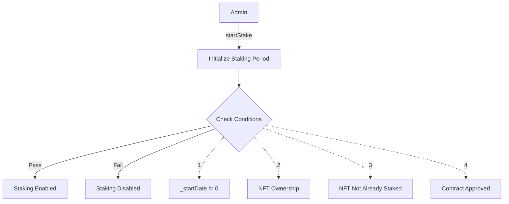
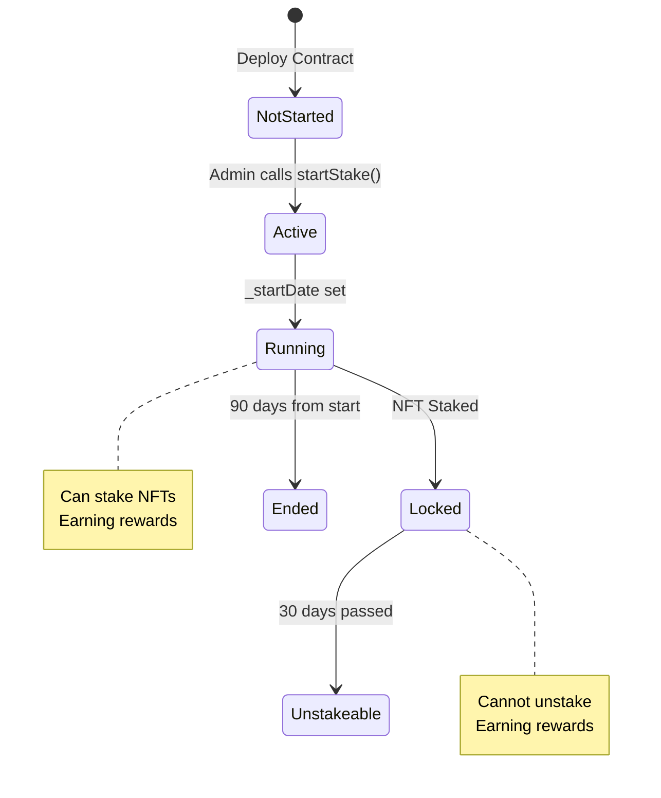
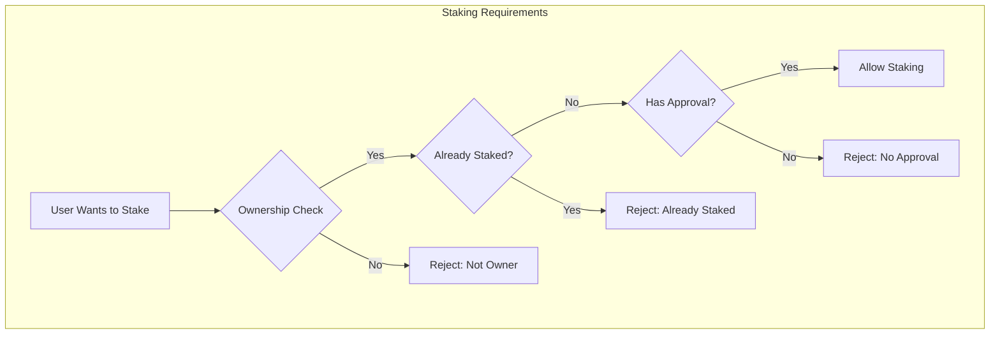
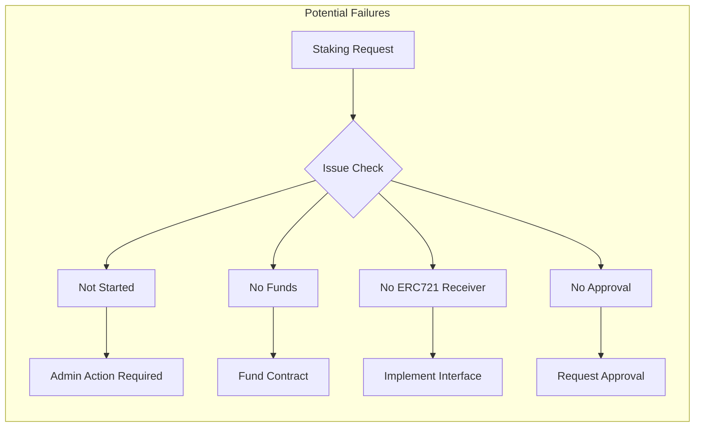
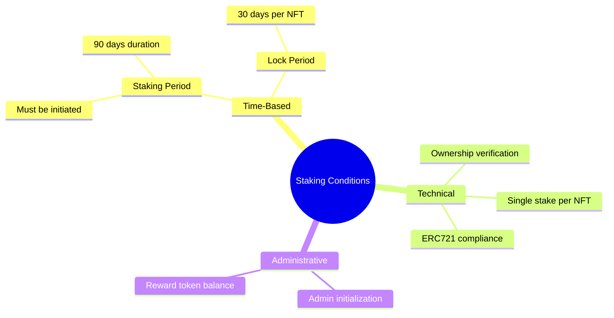

# Analysis of Staking Conditions in `NFTStaking.sol`



This document provides a detailed analysis of the permissions required and granted in the `NFTStaking.sol` smart contract. The goal is to verify if there are any impediment to staking.

## **1. Time-Based Restrictions**



### **a. Staking Period Start and End**

```solidity
uint256 private _startDate;
uint256 private _endDate;

modifier canStake() {
    require(getCanStake(), "You cannot stake at this time");
    _;
}

function getCanStake() public view returns (bool) {
    return _startDate != 0;
}

function startStake() external nonReentrant onlyAdmin() {
    require(_startDate == 0, "startStake: Staking already started!");
    _startDate = block.timestamp;
    _endDate = _startDate + 90 days;
}
```

**Key Conditions:**
- Staking must be initiated by admin via `startStake()`
- `_startDate` must be non-zero to allow staking
- `_endDate` is set to 90 days after start
- **Important Issue:** `getCanStake()` only checks if `_startDate != 0`, not considering `_endDate`

### **b. Lock-Up Period for Unstaking**

```solidity
function unstake(uint256 tokenId) external nonReentrant {
    require(_stakePool[tokenId].owner == msg.sender, "You are not staker of this NFT");
    require(block.timestamp - _stakePool[tokenId].stakeTime >= _stakePool[tokenId].lockPeriod, "Your token is in lock-up period");
    // ... unstaking logic
}
```

**Restrictions:**
- 30-day lock period for each staked NFT
- Users cannot unstake before lock period expires
- Error "Your token is in lock-up period" if attempted early

## **2. Other Conditions and Limits**



### **a. Single Staking per NFT**
```solidity
require(_stakePool[tokenId].stakeTime == 0, "You have already staked this token.");
```
- Each NFT can only be staked once
- Prevents multiple simultaneous stakes of the same NFT

### **b. Ownership Verification**
```solidity
require(nftCollection.ownerOf(tokenId) == msg.sender, "Can't stake tokens you don't own!");
```
- Only the NFT owner can stake it
- Prevents unauthorized staking

## **3. Potential Issues Obstructing Staking**



1. **Staking Not Started:**
   - If admin hasn't called `startStake()`, `_startDate` remains 0
   - Results in "You cannot stake at this time" error
   - **Solution:** Admin must initiate staking period

2. **Contract Not Funded:**
   - Insufficient `rewardToken` balance affects reward claims
   - Doesn't directly block staking but impacts overall functionality
   - **Solution:** Ensure contract has sufficient reward tokens

3. **Missing `onERC721Received`:**
   - Contract lacks `IERC721Receiver` implementation
   - May cause failures with `safeTransferFrom`
   - **Solution:** Implement the interface:
     ```solidity
     function onERC721Received(address, address, uint256, bytes calldata) 
         external pure returns (bytes4) {
         return IERC721Receiver.onERC721Received.selector;
     }
     ```

4. **Approval Requirements:**
   - Users must approve contract for NFT transfers
   - Missing approval causes transfer failures
   - **Solution:** Guide users through approval process

## **Conclusion**



The smart contract includes several conditions that may prevent staking:

1. **Time-Based:**
   - Staking period must be initiated
   - Lock-up period restricts unstaking
   - Missing end date enforcement

2. **Technical:**
   - Single staking limitation
   - Ownership requirements
   - Missing ERC-721 receiver implementation

3. **Administrative:**
   - Requires admin to start staking period
   - Needs sufficient reward token balance

## **Recommendations**

1. **Update Staking Period Check:**
   ```solidity
   function getCanStake() public view returns (bool) {
       return _startDate != 0 && 
              block.timestamp >= _startDate && 
              block.timestamp <= _endDate;
   }
   ```

2. **Implement ERC-721 Receiver:**
   - Add `onERC721Received` for safe transfers

3. **Frontend Integration:**
   - Guide users through approval process
   - Display clear error messages
   - Show staking period status

4. **Administrative Actions:**
   - Ensure staking period is active
   - Maintain sufficient reward token balance
   - Monitor contract state

These conditions ensure secure staking but require careful consideration in implementation and user interaction.
