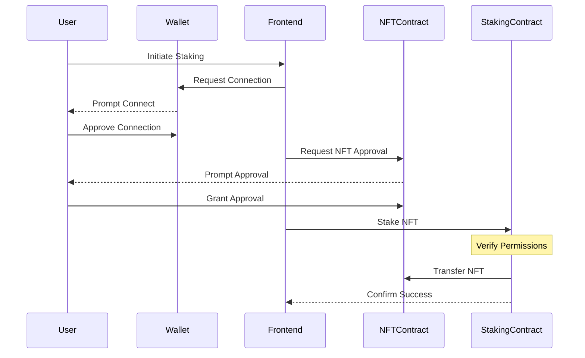
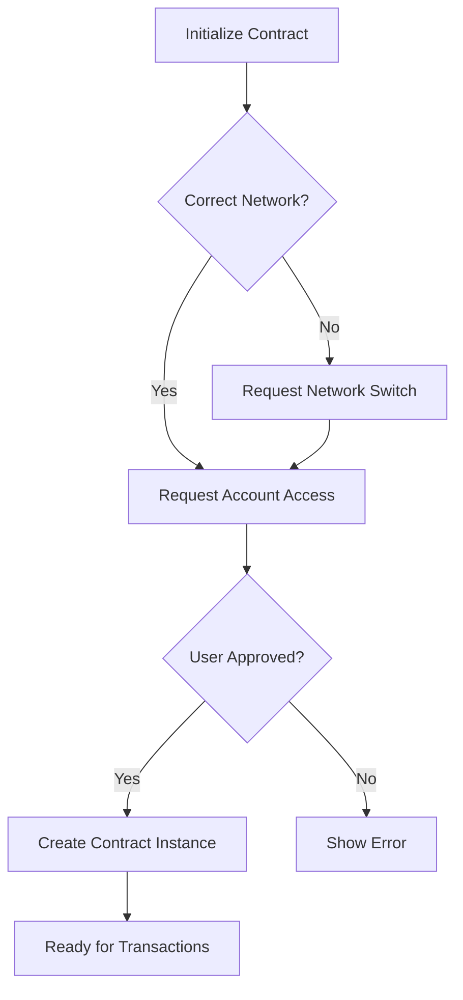
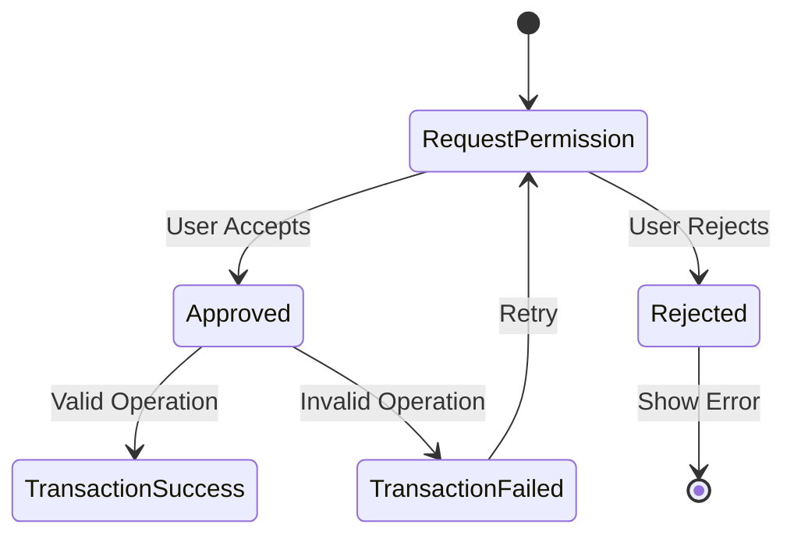

# Analysis of Permissions in the Codebase

This document provides a detailed analysis of the permissions required and granted in the frontend implementation. The goal is to verify whether all necessary permissions have been appropriately handled, including token approvals and any required wallet permissions.



---

## **1. Token Approvals**

In your file `src/utils/Contract.js`, within the `nftStake` function, the code explicitly requests token approval before staking an NFT. Here's the relevant section:

```javascript
export const nftStake = async (address, tokenId) => {
  // ... (network checks and initializations)

  try {
    if (!stakingContract || address !== walletAddressStaking)
      await initStakingContract(address);
    if (!nftCollectionContract)
      await initNftCollectionContract(address);

    // **Token Approval**
    let apptx = await nftCollectionContract.approve(
      stakingContractAddress,
      tokenId
    );
    let appres = await apptx.wait();

    if (appres.transactionHash) {
      // Proceed with staking after approval
      let tx = await stakingContract.stake(tokenId);
      // ...
    }
  } catch (err) {
    // Error handling
  }
};
```

**Explanation:**

- **Approval Transaction:**
  - The `approve` method is called on `nftCollectionContract` to grant permission to `stakingContractAddress` to manage the NFT with `tokenId`.
  - The transaction `apptx` is awaited until it's mined (`await apptx.wait()`).

- **Conditional Staking:**
  - Only after the approval transaction is confirmed does the code proceed to call `stake` on the staking contract.

**Conclusion on Token Approvals:**

- The code correctly handles token approvals by requesting them before staking.
- It ensures that the staking contract has the necessary permissions to transfer the user's NFT.

---

## **2. Wallet Permissions**



Wallet permissions are appropriately requested to enable interactions that require user signatures.

**Examples:**

### **a. Initializing Contracts for Transactions**

In functions like `initStakingContract`, `initNftCollectionContract`, and `initStakingContract`, the code requests wallet permissions:

```javascript
export const initStakingContract = async (address) => {
  walletAddressStaking = address;
  const provider = new ethers.providers.Web3Provider(ethereum);
  // Request Wallet Access
  await provider.send("eth_requestAccounts", []);
  const signer = provider.getSigner();
  stakingContract = new ethers.Contract(
    stakingContractAddress,
    stakingContractABI,
    signer
  );
};
```

**Explanation:**

- **`eth_requestAccounts`:**
  - The method `provider.send("eth_requestAccounts", [])` prompts the user to connect their wallet and grant account access.
  - This is essential for obtaining the user's account address and enabling transaction signing.

- **Signer Usage:**
  - After obtaining access, `provider.getSigner()` is used to sign transactions on behalf of the user.

### **b. Network Switching**

The code checks if the user is connected to the correct network (Sepolia) and attempts to switch if necessary:

```javascript
const chainId = await window.ethereum.request({ method: "eth_chainId" });
if (parseInt(chainId, 16) !== sepoliaChainId) {
  try {
    await window.ethereum.request({
      method: "wallet_switchEthereumChain",
      params: [{ chainId: sepoliaChainIdHex }],
    });
  } catch (error) {
    console.log("error", error);
  }
}
```

**Explanation:**

- **Network Check and Switch:**
  - Ensures that the user's wallet is connected to Sepolia by checking `eth_chainId`.
  - If not, it requests to switch networks using `wallet_switchEthereumChain`.

**Conclusion on Wallet Permissions:**

- The code requests necessary wallet permissions for account access and transaction signing.
- Proper handling of network requirements ensures the user is on the correct blockchain network.

---

## **3. Error Handling and User Feedback**



The code includes error handling to catch and report issues related to permissions:

```javascript
} catch (err) {
  return {
    status: "danger",
    msg: err.error ? err.error.message : "User rejected the transaction."
  };
}
```

**Explanation:**

- Provides feedback if the user rejects a transaction or if an error occurs during the approval or staking process.

---

## **Recommendations**

- **Confirmation of Approvals:**
  - Ensure that the approval transaction is successfully mined before attempting to stake.
  - Consider adding a check to confirm the approval status explicitly.

- **User Prompting:**
  - Make sure the UI informs the user that they need to approve token transfer before staking can proceed.
  - Provide clear instructions or alerts if an approval is pending.

- **Error Messaging:**
  - Enhance error messages to be more descriptive, aiding in troubleshooting (e.g., differentiate between approval rejection and staking transaction failure).

- **Event Listeners:**
  - Implement event listeners to detect when the approval has been granted, preventing race conditions.

---

## **Summary**

- **Token Approvals:**
  - The necessary token approvals are requested and handled in the staking function.
  - Approval is a prerequisite before proceeding with staking.

- **Wallet Permissions:**
  - Wallet connection and permissions are appropriately requested.
  - Network checks and switches are implemented to ensure compatibility.

- **Overall:**
  - The codebase appears to have all necessary permissions requests in place.
  - If staking is still not functioning, further investigation may be required into:
    - The smart contract logic (e.g., staking period validity).
    - The user's wallet responses (e.g., if approvals are being confirmed).
    - Possible blockchain network issues.

---
