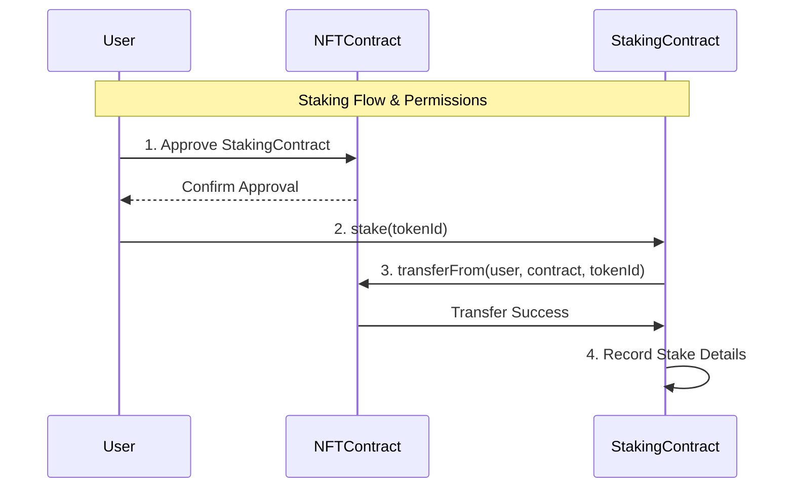
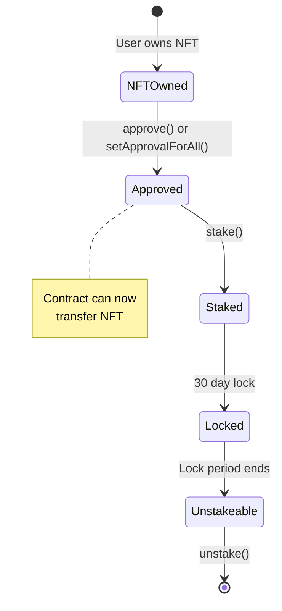
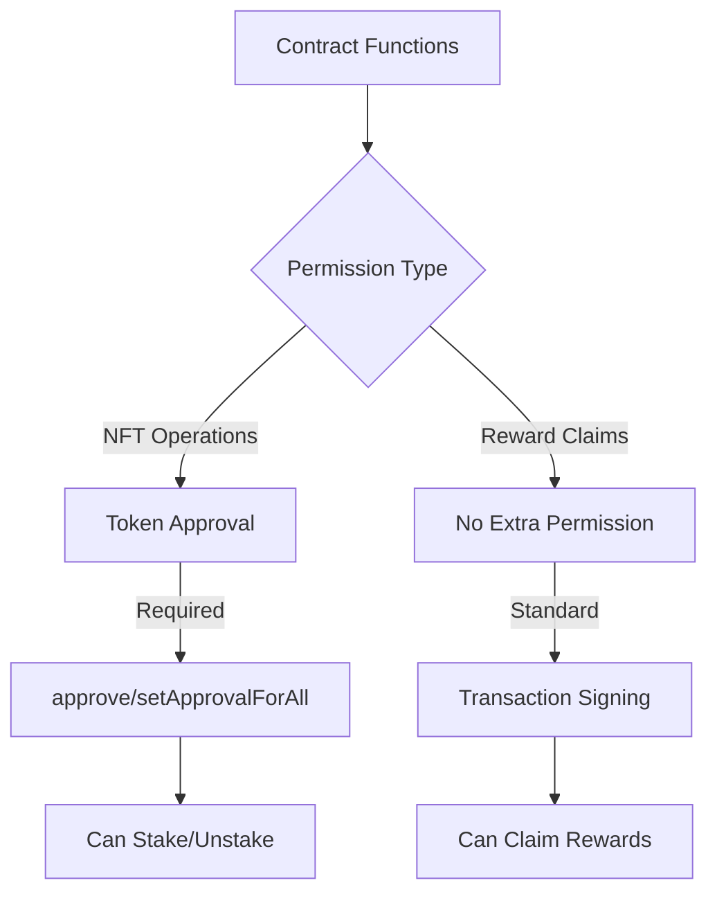

# Analysis of Permissions in `NFTStaking.sol`



This document provides a detailed analysis of the permissions required and granted in the `NFTStaking.sol` smart contract. The goal is to verify whether all necessary permissions have been appropriately handled, including token approvals and any required wallet permissions.

---

## **1. Token Approvals**



### **a. Staking Functionality**

**Code Snippet:**

```solidity
function stake(uint256 tokenId) external nonReentrant canStake() {
    require(nftCollection.ownerOf(tokenId) == msg.sender, "Can't stake tokens you don't own!");
    require(_stakePool[tokenId].stakeTime == 0, "You have already staked this token.");

    nftCollection.transferFrom(msg.sender, address(this), tokenId);

    _stakePool[tokenId].owner = msg.sender;
    _stakePool[tokenId].tokenId = tokenId;
    _stakePool[tokenId].stakeTime = block.timestamp;
    _stakePool[tokenId].lockPeriod = 30 days;

    _ownedPoolTokens[msg.sender].push(tokenId);
    nftTotalStaked++;
}
```

**Explanation:**

- **Ownership Verification:**
  - The contract checks if the `msg.sender` is the owner of the NFT using `nftCollection.ownerOf(tokenId)`.
  - This ensures only the rightful owner can stake the NFT.

- **Approval Requirement:**
  - The `nftCollection.transferFrom(msg.sender, address(this), tokenId)` function transfers the NFT to the staking contract.
  - For this transfer to succeed, the user must **approve** the staking contract to manage their NFT.
  - Approval is handled externally by the user through the NFT contract's `approve` or `setApprovalForAll` functions.

**Conclusion on Token Approvals:**

- **Necessary Approvals Are Required:**
  - Users must grant approval to the staking contract before staking.
  - Without approval, the `transferFrom` call will fail, and the staking process cannot proceed.

- **Contract Assumes Approval Is Granted:**
  - The contract relies on the standard ERC-721 approval mechanism.
  - It does not perform additional checks for approvals, as `transferFrom` will revert if approval is not given.

### **b. Unstaking Functionality**

**Code Snippet:**

```solidity
function unstake(uint256 tokenId) external nonReentrant {
    require(_stakePool[tokenId].owner == msg.sender, "You are not staker of this NFT");
    require(block.timestamp - _stakePool[tokenId].stakeTime >= _stakePool[tokenId].lockPeriod, "Your token is in lock-up period");

    nftCollection.transferFrom(address(this), msg.sender, tokenId);

    delete _stakePool[tokenId];
    // Remove tokenId from _ownedPoolTokens[msg.sender]; (Implementation needed)
    nftTotalStaked--;
}
```

**Explanation:**

- **Ownership and Lock Period Verification:**
  - Ensures the caller is the original staker (`_stakePool[tokenId].owner == msg.sender`).
  - Verifies that the lock-up period has expired.

- **Token Transfer:**
  - Since the contract owns the NFT, it can transfer it back to the user without needing approval.
  - Uses `nftCollection.transferFrom(address(this), msg.sender, tokenId)`.

**Conclusion:**

- **No Additional Permissions Needed:**
  - Users do not need to grant any additional permissions to unstake their NFTs.
  - The contract manages the transfer back to the user.

---

## **2. Wallet Permissions**



### **a. Claiming Rewards**

**Code Snippet:**

```solidity
function claimReward(address ownerAddress) external nonReentrant {
    uint256 _claimableReward = getOwnedRewards(ownerAddress) - _claimedRewards[ownerAddress];
    bool _success = rewardToken.transfer(ownerAddress, _claimableReward);

    if (!_success)
        revert ClaimReward__TransferFailed();

    _claimedRewards[ownerAddress] += _claimableReward;
}
```

**Explanation:**

- **Calculating Claimable Rewards:**
  - Determines the number of `rewardToken` rewards based on staked NFTs.

- **Token Transfer:**
  - The contract transfers `rewardToken` to the user's address.
  - No approval is needed from the user, as the contract initiates the transfer.

**Conclusion on Wallet Permissions:**

- **User Wallet Permissions:**
  - Users do not need to grant additional wallet permissions to claim rewards.
  - Standard transaction confirmations are sufficient.

---

## **3. Permissions in Custom Functions**

### **a. Staking Period Management**

**Code Snippet:**

```solidity
function getCanStake() public view returns (bool) {
    return _startDate != 0;
}

modifier canStake() {
    require(getCanStake(), "You cannot stake at this time");
    _;
}
```

**Explanation:**

- **Staking Window Enforcement:**
  - The `canStake` modifier checks if staking has started by verifying `_startDate` is set.
  - However, it does not check if the current time is within the staking period ending at `_endDate`.

**Observation:**

- **Missing End Date Check:**
  - The contract does not enforce an end date in the `canStake` modifier.
  - This means staking could potentially continue indefinitely after `_endDate`.

**Recommendation:**

- **Include End Date in Staking Condition:**

  ```solidity
  function getCanStake() public view returns (bool) {
      return _startDate != 0 && block.timestamp >= _startDate && block.timestamp <= _endDate;
  }
  ```

  - Implements a comprehensive check to ensure staking only occurs within the defined period.

### **b. Receiving ERC-721 Tokens**

**Observation:**

- **Lack of `onERC721Received` Implementation:**
  - The contract does not implement the `IERC721Receiver` interface.
  - Without this, if a user attempts to use `safeTransferFrom`, the transfer may fail.

**Recommendation:**

- **Implement `onERC721Received` Function:**

  ```solidity
  function onERC721Received(address, address, uint256, bytes calldata) external pure returns (bytes4) {
      return IERC721Receiver.onERC721Received.selector;
  }
  ```

  - Enables the contract to receive NFTs via `safeTransferFrom`, increasing compatibility.

---

## **4. Addressing Potential Issues**

### **a. Insufficient Balance for Rewards**

- **Issue:**
  - The contract must have enough `rewardToken` balance to distribute rewards.
  - If the balance is insufficient, reward claims will fail.

- **Recommendation:**
  - Implement a mechanism for the admin to fund the contract with `rewardToken`.
  - Add checks to alert when the balance is low.

### **b. Removal of Token IDs from Owned List**

- **Issue:**
  - In the `unstake` function, the code comment indicates the need to remove the token ID from `_ownedPoolTokens[msg.sender]`, but the implementation is missing.

- **Recommendation:**
  - Implement logic to remove the token ID from the user's owned tokens array.

  ```solidity
  // Remove tokenId from _ownedPoolTokens[msg.sender];
  for (uint256 i = 0; i < _ownedPoolTokens[msg.sender].length; i++) {
      if (_ownedPoolTokens[msg.sender][i] == tokenId) {
          _ownedPoolTokens[msg.sender][i] = _ownedPoolTokens[msg.sender][_ownedPoolTokens[msg.sender].length - 1];
          _ownedPoolTokens[msg.sender].pop();
          break;
      }
  }
  ```

### **c. Event Emission**

- **Issue:**
  - The contract does not emit events for staking or unstaking, which are important for off-chain tracking.

- **Recommendation:**
  - Add events to improve transparency and facilitate monitoring.

  ```solidity
  event Stake(address indexed user, uint256 tokenId, uint256 timestamp);
  event Unstake(address indexed user, uint256 tokenId, uint256 timestamp);

  // Inside stake function
  emit Stake(msg.sender, tokenId, block.timestamp);

  // Inside unstake function
  emit Unstake(msg.sender, tokenId, block.timestamp);
  ```

---

## **5. Recommendations**

### **a. Frontend Integration**

- **User Guidance:**
  - The frontend should prompt users to approve the staking contract for NFT transfers.
  - Provide clear instructions on how to grant approval.

- **Approval Verification:**
  - Before attempting to stake, the frontend can check if approval is already granted.
  - If not, initiate the approval process.

### **b. Enhanced Error Messages**

- **Improve Clarity:**
  - Modify error messages to be more descriptive.
  - Helps users understand why a transaction failed.

### **c. Contract Enhancements**

- **Implement Staking Period Enforcement:**
  - Update the `canStake` modifier to include `_endDate` in the staking condition.

- **Implement `onERC721Received`:**
  - Ensure the contract can handle NFTs sent via `safeTransferFrom`.

- **Maintain Token Balance for Rewards:**
  - Provide functions for the admin to fund the contract.
  - Optionally, allow the contract to mint `rewardToken` if it's a mintable token.

---

## **6. Summary**

- **Token Approvals:**
  - Users must approve the staking contract to transfer their NFTs.
  - The contract assumes approval has been granted as per the ERC-721 standard.

- **Wallet Permissions:**
  - No additional wallet permissions are required beyond standard transaction confirmations.
  - Users initiate transactions to interact with the contract functions.

- **Contract Permissions:**
  - Administrative functions are restricted to the admin role using `onlyAdmin`.

- **Staking Period Enforcement:**
  - The current implementation lacks an end date check in `canStake`.
  - Updating the contract to include `_endDate` ensures staking cannot occur after the staking period ends.

- **Receiving NFTs via `safeTransferFrom`:**
  - Implementing `onERC721Received` enhances compatibility with ERC-721 standards.

- **Event Emission:**
  - Emitting events for staking and unstaking improves transparency and aids in off-chain tracking.

---

## **Conclusion**

The `NFTStaking.sol` smart contract generally handles permissions appropriately:

- **Token Approvals:** Required and enforced through the standard ERC-721 mechanisms.
- **Wallet Permissions:** Standard user confirmations are sufficient; no extra permissions are needed.
- **Administrative Control:** Properly restricted to the admin account.

**Areas for Improvement:**

- **Staking Period Check:**
  - Include `_endDate` in the `canStake` modifier to prevent staking after the period ends.

- **ERC-721 Compliance:**
  - Implement `onERC721Received` to handle `safeTransferFrom` calls.

- **Maintaining State Consistency:**
  - Ensure the user's staked tokens list is accurately updated during unstaking.

- **Event Emission:**
  - Adding events for critical actions enhances usability and monitoring.
